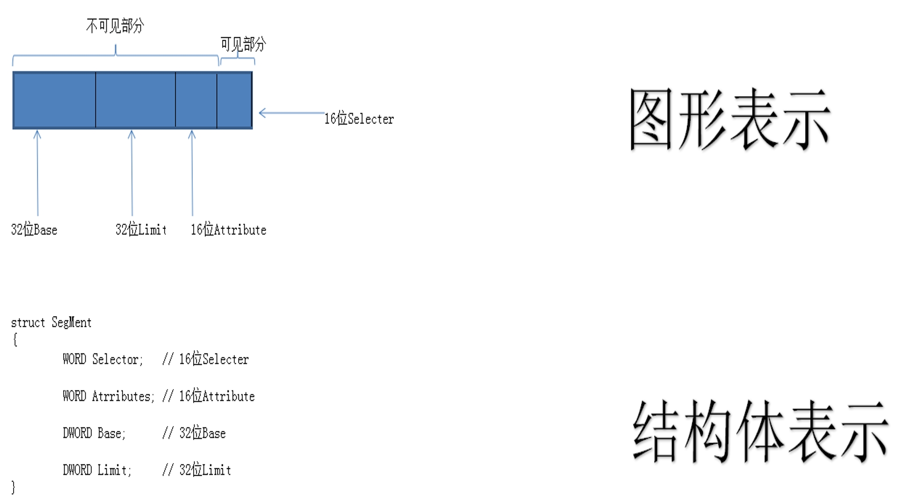

### 要点回顾：

保护模式的2种重要机制：段和页

段的机制非常复杂，想了解段机制要先了解段寄存器

### 1、什么是段寄存器？有哪些？

当我们用汇编读写某一个地址时：

mov dword ptr ds:[0x123456],eax

我们真正读写的地址是：ds.base + 0x123456
	

ES CS SS DS FS GS LDTR TR  共8个

### 2、段寄存器的结构

### 3、段寄存器的读写

#### 读段寄存器

比如：MOV AX,ES    只能读16位的可见部分

读写LDTR的指令为：SLDT/LLDT

读写TR的指令为：STR/LTR

#### 写段寄存器

 比如：MOV DS,AX   写时是写96位  

### 课后练习：

1) 段寄存器只能看见16位，如何证明有96位？

2) 写段寄存器时，只给了16位，剩下的80位填什么？	