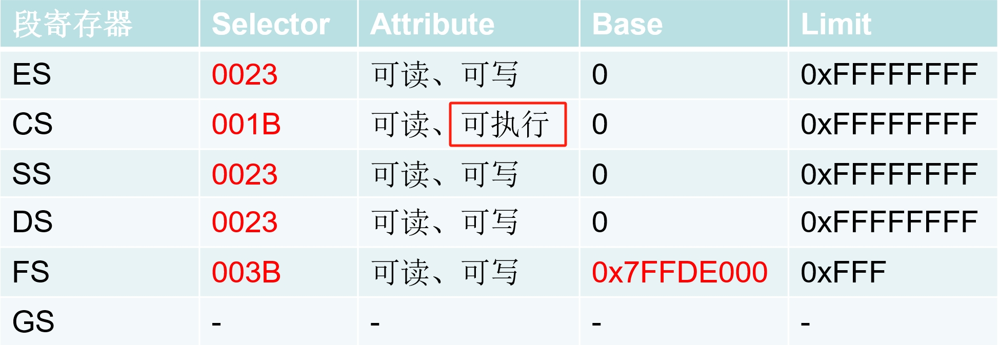

### 要点回顾：

上一节课我们讲过段寄存器有96位：

Selector  //16位

Atrribute  //16位

Base	 //32位

Limit	 //32位

我们可以通过MOV指令进行读写（LDTR和TR除外）

但我们只能看见16位，那如果证明Attribute、Base、Limit的存在呢？

### 1、段寄存器成员简介

### 2、探测Attribute

int var = 0;					

__asm					

{					

​	mov ax,ss	//cs不行 cs是可读 可执行 但不可写	

​	mov ds,ax				

​	mov dword ptr ds:[var],eax				

}	

**证明的段寄存器里有属性的存在，可读，可写，可执行**

### 3、探测Base

int var = 0;					

__asm					

{					

​	mov ax,fs				

​	mov gs,ax				

​	mov eax,gs:[0]	//不要用DS 否则编译不过去	

​	mov dword ptr ds:[var],eax	

​	//mov edx,dword ptr ds:[0x7FFDF000]

}	

**DS编译不过是因为操作系统进0环，会清掉GS，导致访问 GS:[0] 时，base仍然为0，所以出错**

**换成FS，因为 FS 的 base 为 0x7FFDE000，所以最终 eax 的值为 [0x7FFDE000 + 0]**

### 4、探测Limit

int var = 0;					

__asm					

{					

​	mov ax,fs				

​	mov gs,ax				

​	mov eax,gs:[0x1000]	//不要用DS 否则编译不过去	

​	mov dword ptr ds:[var],eax	

​	//mov edx,dword ptr ds:[0x7FFDF000]

}	

**因为 FS 的 limit 为 0xFFF, 0x1000超出了范围，证明了 limit 的存在**

### 课后练习：

写段寄存器时，只给了16位，剩下的80位填什么？数据从哪里来？	