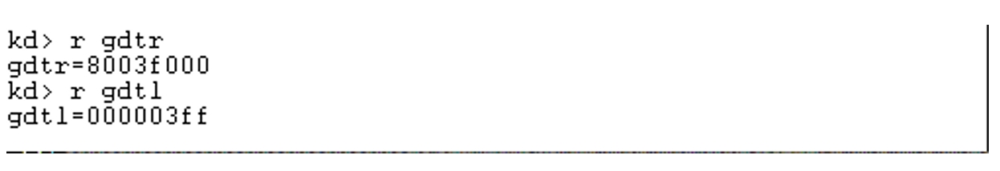
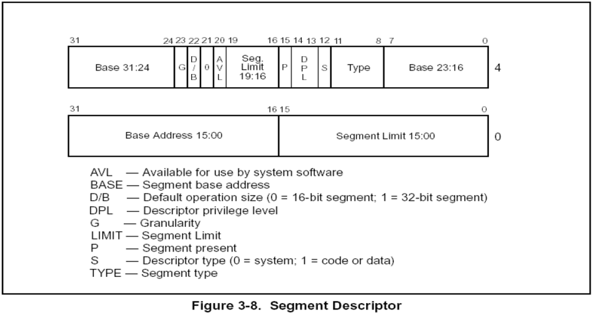
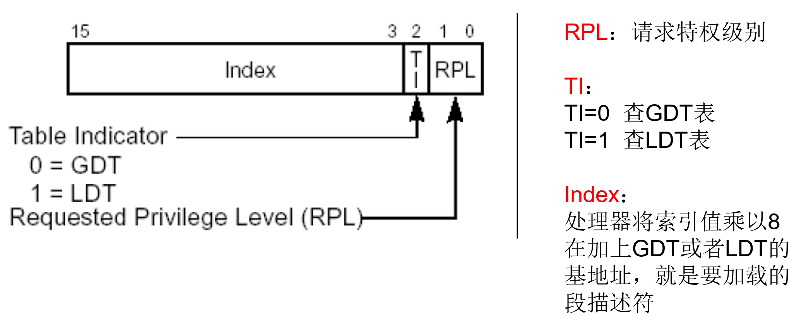

### 要点回顾：

上一节课我们讲过，当写一个段寄存器的时候，只给了一个16位的数，但段寄存器有96位，那剩下的80位从哪里来的？这个16位的数是随便写的吗？

### 1、GDT(全局描述符表)  LDT(局部描述符表)

当我们执行类似MOV DS,AX指令时，CPU会查表，根据AX的值来决定

查找GDT还是LDT,查找表的什么位置，查出多少数据.

### 2、段描述符

**DPL 如果你要访问我，你应该要具备什么样的特权。**

### 3、段选择子

段选择子是一个16位的段描述符，该描述符指向了定义该段的段描述符.		

**RPL 是我以什么样的特权访问你**

### 4、加载段描述符至段寄存器

除了MOV指令，我们还可以使用**LES、LSS、LDS、LFS、LGS**指令修改寄存器.

CS不能通过上述的指令进行修改，CS为代码段，CS的改变会导致EIP的改变，要改CS，必须要保证CS与EIP一起改，后面会讲.

char buffer[6];					

__asm				

{

​	les ecx,fword ptr ds:[buffer] //高2个字节给es，低四个字节给ecx	

}

注意：RPL<=DPL(在数值上)

**fword 表示6个字节**

**LES、LSS、LDS、LFS、LGS 这5个指令表示，都是从指定内存中的高2个字节赋值给段寄存器**

### 课后练习：

1、记住段描述符与段选择子的结构

2、使用LES、LDS等指令修改段寄存器

#### 思考题：

段描述符共有64位，但需要填充的是80位，怎么填？	
