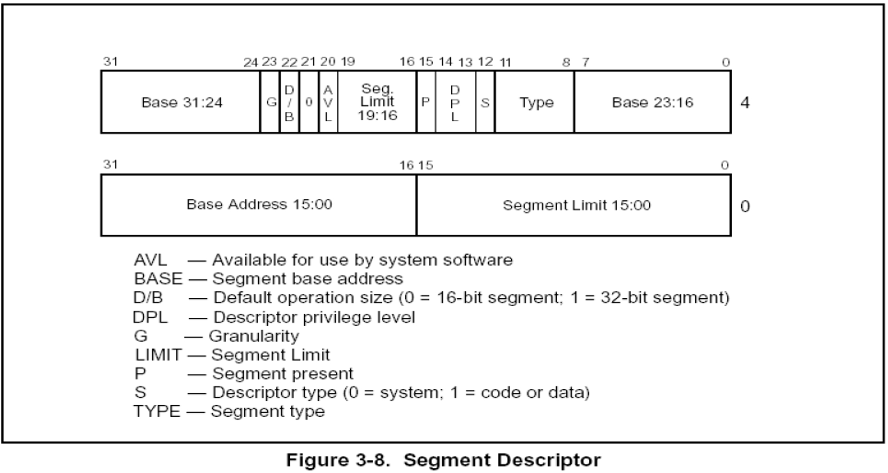
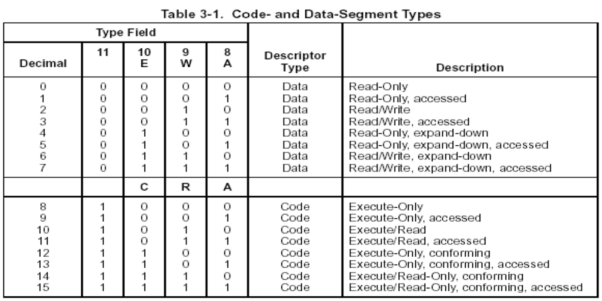
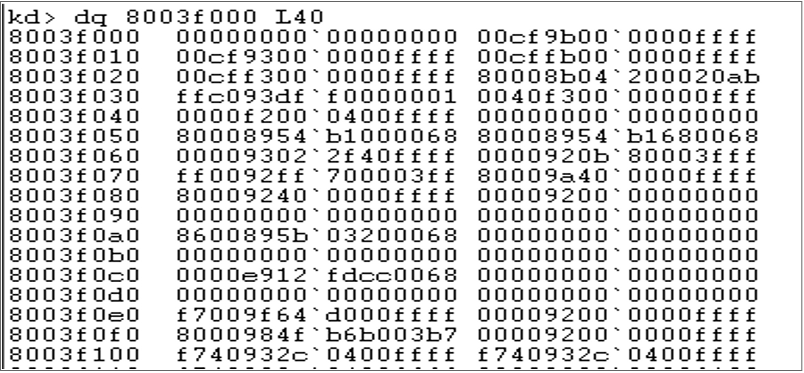
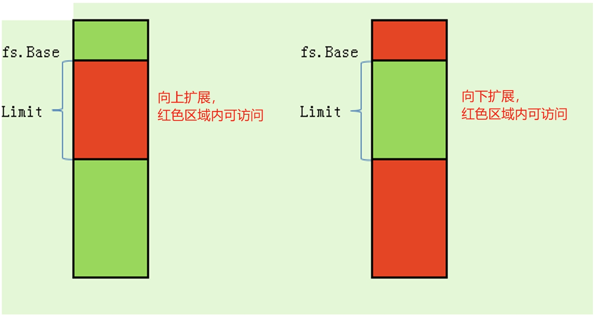
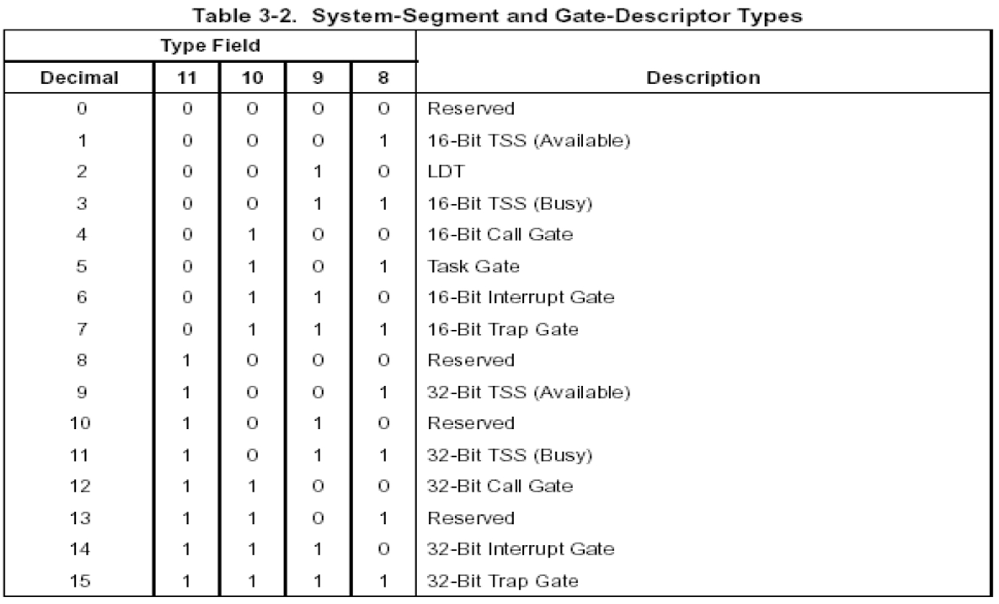

### 段描述符属性：S位 TYPE域

### 1、段描述符	

### 2、S位

**S = 1 代码段或者数据段描述符**

**S = 0 系统段描述符**

### 3、TYPE域

### 4、分析举例

### 5、数据段说明

A 访问位，表示该位最后一次被操作系统清零后，该段是否被访问过.每当处理器将该段选择符置入某个段寄存器时，就将该位置1.
W 是否可写
E 扩展方向

### 6、代码段说明

A 访问位 

R 可读位 

C 一致位

C = 1 一致代码段 

C = 0 非一致代码段

### 7、系统段描述符

当S=0时，该段描述符为系统描述符.系统描述符有分为以下类型：

### 课后练习：

1、找出所有数据段，并分析该段属性：只读、已访问、可读可写、拓展方向
2、找出所有代码段，并分析该段属性：只执行、可读可执行、已访问、一致代码
3、找出所有系统段，并分析属性.