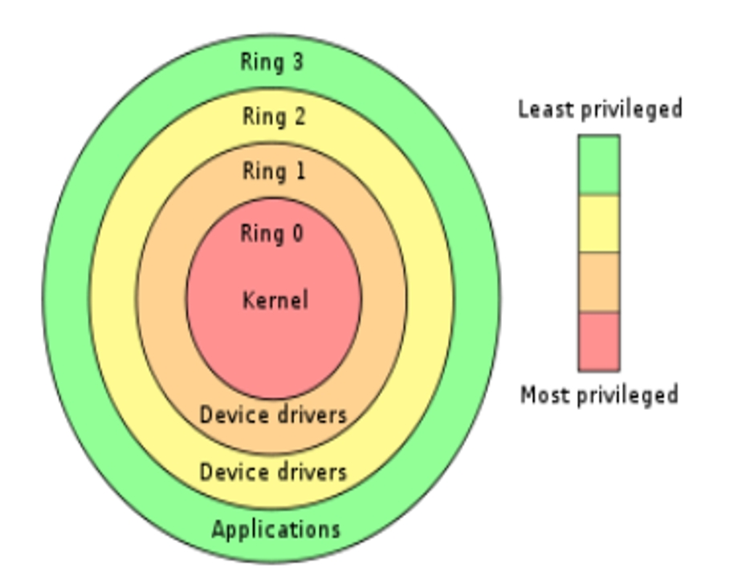
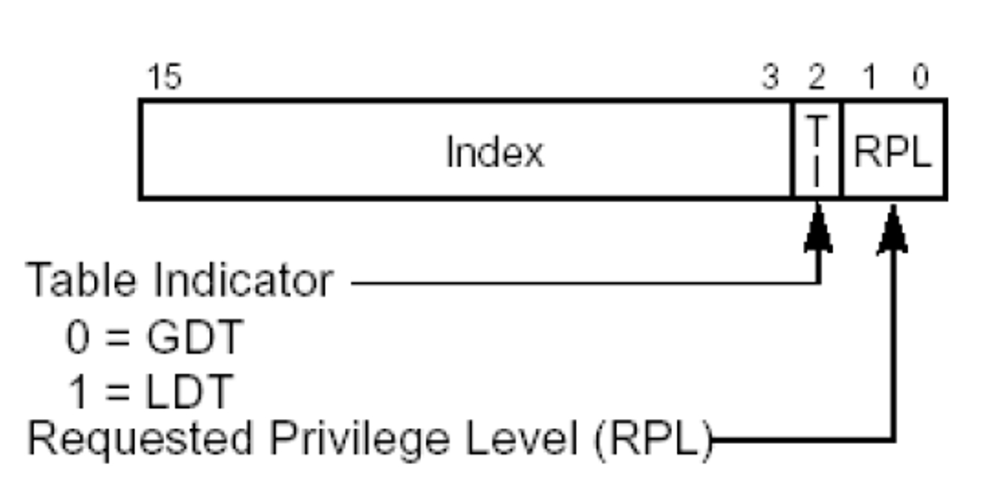

### 段权限检查

MOV DS,AX

### 1、CPU分级

### 2、如何查看程序处于几环?

CPL(Current Privilege Level) ：当前特权级 	

**CS和SS中存储的段选择子后2位.**	

**就看CS段后2位，查看当前程序的特权级**

### 3、DPL(Descriptor Privilege Level)  描述符特权级别

### 3、DPL(Descriptor Privilege Level)  描述符特权级别

DPL存储在段描述符中，规定了访问该段所需要的特权级别是什么.

通俗的理解：

如果你想访问我，那么你应该具备什么特权. 	

举例说明：

mov DS,AX  

如果AX指向的段DPL = 0  但当前程序的CPL = 3 这行指令是不会成功的！

### 4、RPL(Request Privilege Level)  请求特权级别

RPL是针对段选择子而言的，每个段的选择子都有自己的RPL。

### 4、RPL(Request Privilege Level)  请求特权级别

举例说明：

Mov ax,0008	与	Mov ax,000B 		//段选择子  		

Mov ds,ax		Mov ds,ax		//将段描述

指向的是同一个段描述符,但RPL是不一样的.

### 5、数据段的权限检查

参考如下代码：

比如当前程序处于0环，也就是说CPL=0

Mov ax,000B	//1011   RPL = 3

Mov ds,ax	//ax指向的段描述符的DPL = 0

数据段的权限检查：

**CPL <= DPL  并且 RPL <= DPL (数值上的比较)**

注意：

代码段和系统段描述符中的检查方式并不一样,具体参加后面课程.

### 6、总结：

**CPL  CPU当前的权限级别**

**DPL  如果你想访问我，你应该具备什么样的权限**

**RPL  用什么权限去访问一个段**

为啥要有RPL?

  我们本可以用“读 写”的权限去打开一个文件，但为了避免出错，有些时候我们使用“只读”的权限去打开。