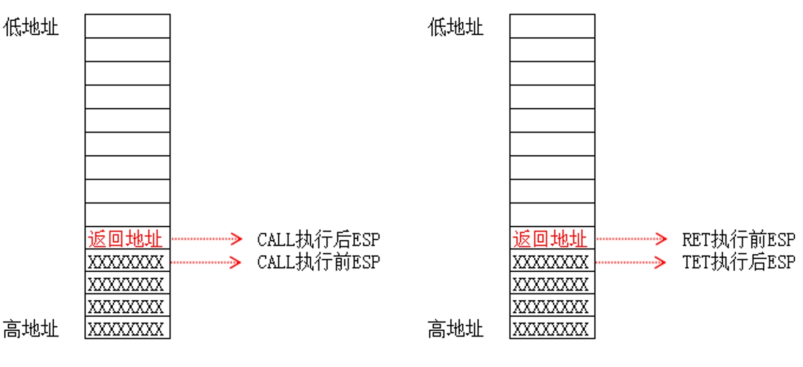
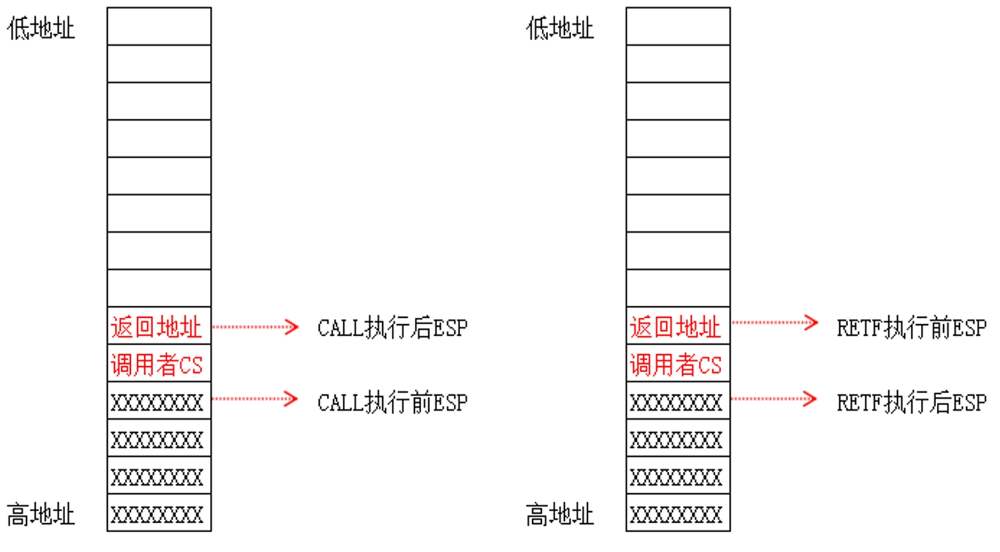
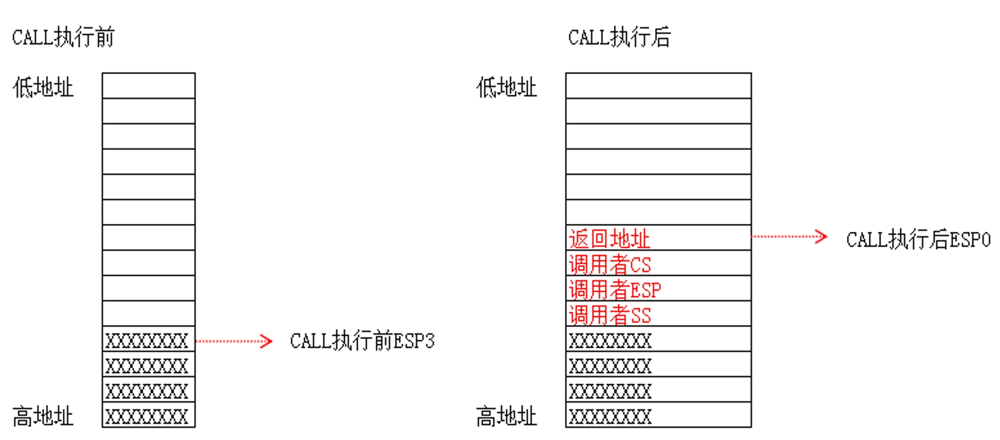
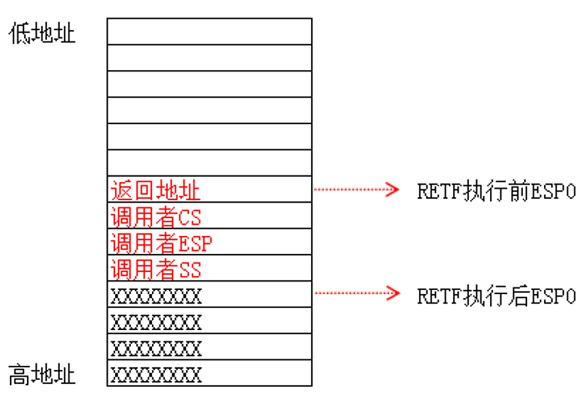

### 本节内容

长调用与短调用堆栈图(无参)

要点回顾：

我们通过JMP FAR可以实现段间的跳转，如果要实现跨段的调用就必须要学习CALL FAR，也就是长调用.

CALL FAR 比JMP FAR要复杂，JMP并不影响堆栈,但CALL指令会影响.

### 1、短调用

指令格式：CALL  立即数/寄存器/内存

**发生改变的寄存器：ESP EIP**

### 2、长调用(跨段不提权)

指令格式：CALL  CS:EIP(EIP是废弃的)

**发生改变的寄存器：ESP EIP  CS**

### 3、长调用(跨段并提权)

指令格式：CALL  CS:EIP(EIP是废弃的)

**发生改变的寄存器：ESP EIP  CS SS**

### 4、长调用(跨段并提权)

指令格式：CALL  CS:EIP(EIP是废弃的)

**发生改变的寄存器：ESP EIP  CS SS**

### 5、总结：

跨段调用时，一旦有权限切换，就会切换堆栈.

1. CS的权限一旦改变，SS的权限也要随着改变，**CS与SS的等级必须一样**.

2. JMP FAR 只能跳转到同级非一致代码段，但CALL FAR可以通过调用门提权，提升CPL的权限.

  

SS与ESP从哪里来？参见TSS段.

### 6、课后练习：

记住CALL指令执行时的堆栈变化.
