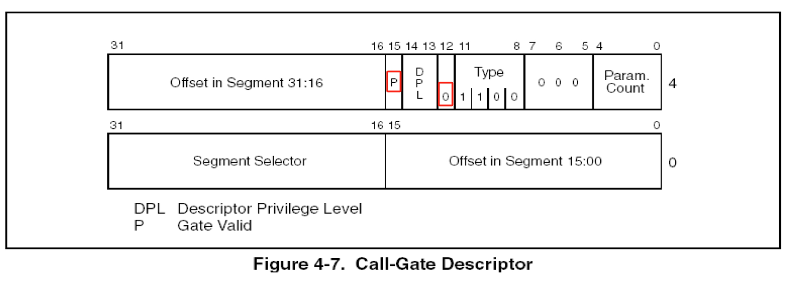

### 调用门(无参)

### 要点回顾：

上一节课我们讲过CALL FAR指令，指令个数如下：

指令格式：CALL  CS:EIP(EIP是废弃的)

### 1、调用门执行流程

指令格式：CALL  CS:EIP(EIP是废弃的)

执行步骤：

1) 根据CS的值 查GDT表，找到对应的段描述符  这个描述符是一个**调用门**.
2) **在调用门描述符中存储另一个代码段段的选择子**.
3) 选择子指向的段  **段.Base + 偏移地址** 就是真正要执行的地址.

### 2、门描述符

### 3、构造一个调用门（无参  提权）

0040EC00 000810D0

### 4、代码测试

步骤一：代码测试，并观察堆栈与寄存器的变化.

记录执行前的寄存器值：

CS   SS   ESP

步骤二：在测试代码中加入特权指令并读取高2G内存.

### 6、课后练习：

自己实现调用门