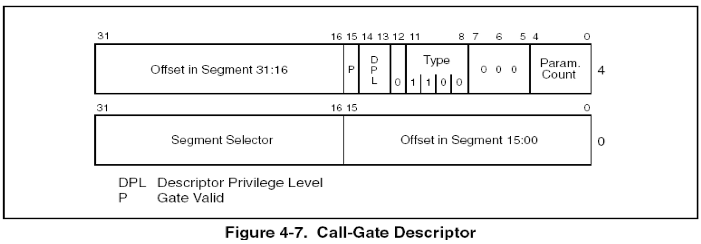

### 调用门(有参)


### 要点回顾：

上一节课我们讲了调用门的执行过程，这一节我们讲解一下

调用门的参数传递


### 1、构造一个带参数的调用门



调用门描述符：0040EC03 00081030

```
> eq 8003f048 0040EC03`00081030
```


### 2、代码测试

(课堂演示)


### 3、调用门总结：

1) 当通过门，权限不变的时候，只会PUSH两个值：**CS  返回地址**  新的CS的值由调用门决定
2) 当通过门，权限改变的时候，会PUSH四个值：**SS ESP CS  返回地址**   新的CS的值由调用门决定  **新的SS和ESP由TSS提供**
3) 通过门调用时，要执行哪行代码有调用门决定，但使用RETF返回时，由堆栈中压人的值决定，这就是说，进门时只能按指定路线走，出门时可以翻墙(**只要改变堆栈里面的值就可以想去哪去哪**)	
4) 可不可以再建个门出去呢?也就是用Call  当然可以了 前门进 后门出	


### 4、课后练习：

1、

​	pushad					
​	pushfd				
​	...
​	popfd				
​	popad	

这几行代码有什么意义？是必须的吗？

意义是保存现场，不是必须的。


2、	

mov eax,[esp+0x24+0x8+0x8]

mov eax,[esp+0x24+0x8+0x8]

mov eax,[esp+0x24+8+0]

这几行代码在做什么？

获取参数