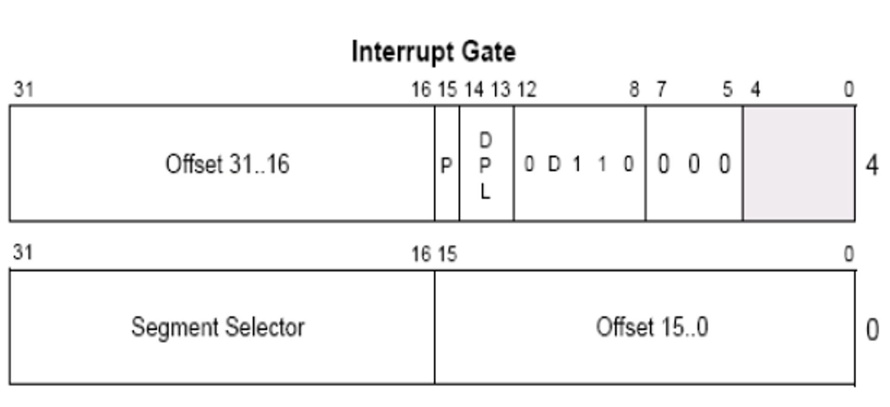

### 要点回顾：

Windows没有使用调用门，但是使用了中断门：

<1> 系统调用

<2> 调试

### 1、IDT

IDT即中断描述符表,同GDT一样，IDT也是由一系列描述符组成的，每个描述符占8个字节。但要注意的是，IDT表中的第一个元素不是NULL。

在windbg中查看IDT表的基址和长度:

### 2、IDT表的构成

IDT表可以包含3种门描述符：

任务门描述符

中断门描述符

陷阱门描述符

### 3、中断门描述符

所有描述符的结构，8-15位是不会变的。分别是 P位， DPL， S位 ，TYPE位，

首先找P位=1，S位=0，TYPE位=1110，表示32位中断门

中断门通过 int 指令触发，去找 IDT 表

### 4、构造一个中断门

(参见课堂演示)

### 5、中断执行

INT X

其中，X 是索引，X * 8 + IDT 的基址，就是具体的中断门描述符

### 6、中断返回

INT N指令:

1、在没有权限切换时，会向堆栈PUSH 3个值，分别是 ：

CS EFLAG EIP （返回地址）

2、在有权限切换时，会向堆栈PUSH 5个值，分别是：

SS ESP EFLAG CS EIP 

**在中断门中，不能通过RETF返回，而应该通过 IRET/IRETD 指令返回。**

### 7、调用门与中断门的区别

1、调用门通过 CALL FAR 指令执行，但中断门通过 INT 指令

2、调用门查询 GDT 表，中断门查询 IDT 表

3、CALL CS:EIP 中的 CS 是段选择子，由3部分组成

但 INT N 指令中的N只是索引，中断门不会检查 RPL，只检查CPL

### 课后练习：

1、自已实现中断门

2、在调用门中实现使用 IRETD 返回，在中断门中实现用 RETF 返回。

<线上班>学员可见