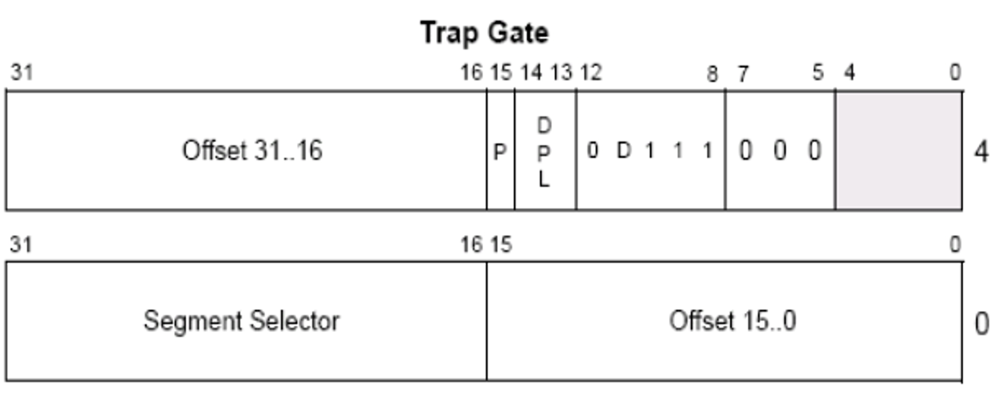
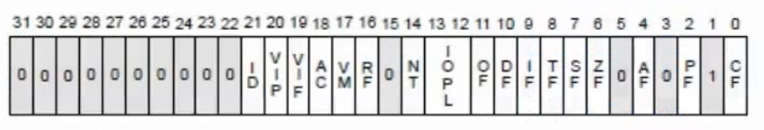

### 要点回顾：

 IDT表可以包含3种门描述符：

 任务门描述符

 中断门描述符

 陷阱门描述符


### 1、陷阱门描述符



### 2、构造一个陷阱门

1、构造一个陷阱门 0040EF00`00081030

2、写入到IDT表中

```
> eq 8003f500 0040EF00`00081030
```

3、执行陷阱门


### 3、通过中断门与陷阱门打印EFLAG寄存器的值

执行前：216

执行中：

​	陷阱门：216

​	中断门：16


### 4、EFLAG寄存器结构



IF标志用于控制处理器对可屏蔽中断请求的响应，置1以响应可屏蔽中断，反之则禁止可屏蔽中断。

IF标志只对**不可屏蔽中断**没有影响。


### 5、陷阱门与中断门的区别

中断门执行时，将IF位清零，但陷阱门不会。


### 课后练习：

<线上班>学员可见