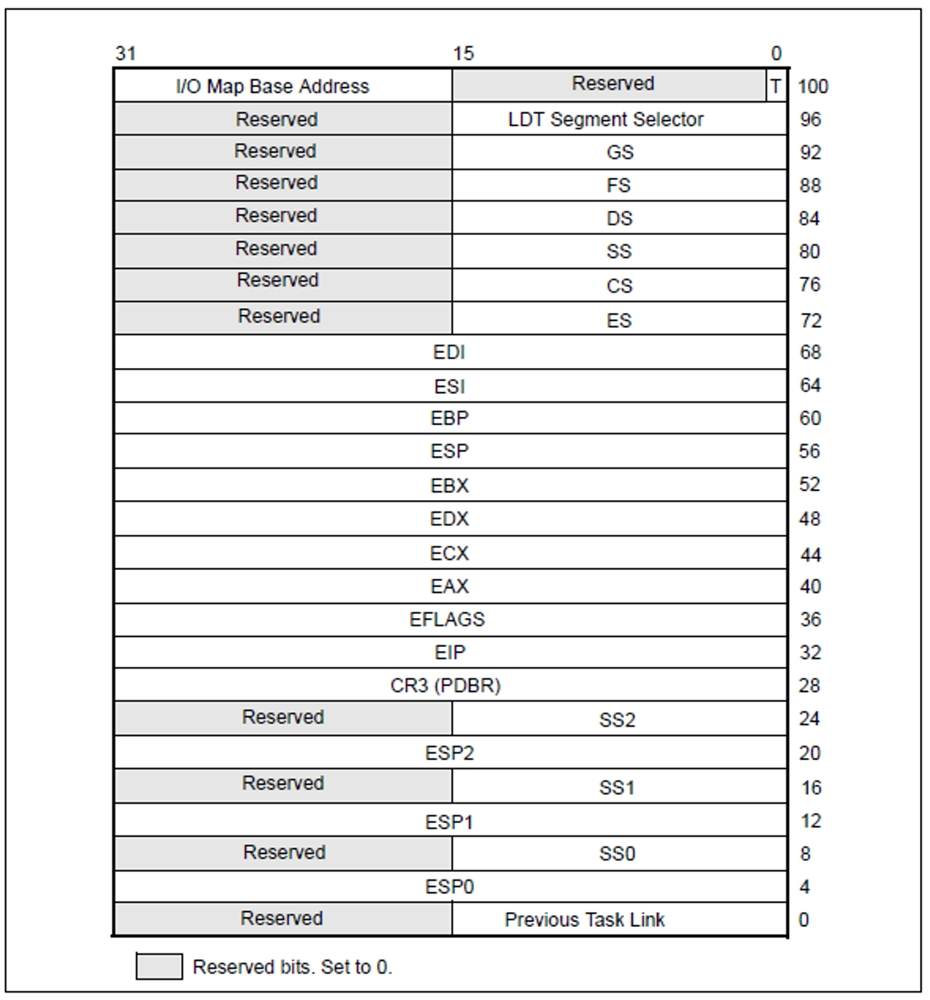
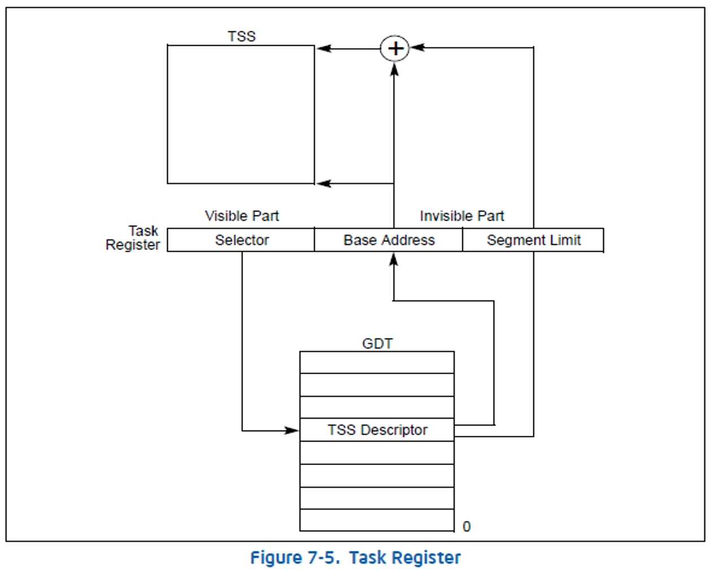
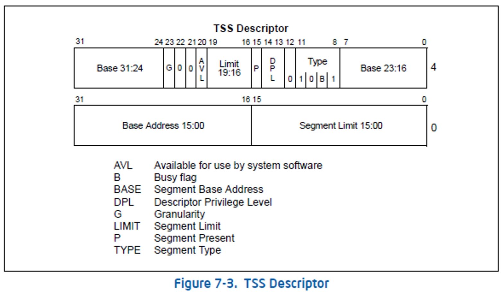

### 要点回顾：

在调用门、中断门与陷阱门中，一旦出现权限切换，那么就会有堆栈的切换。而且，由于CS的CPL发生改变，也导致了SS也必须要切换。

切换时，会有新的ESP和SS(CS是由中断门或者调用门指定)这2个值从哪里来的呢？

答案：TSS (Task-state segment )，任务状态段.

### 1、TSS的结构

TSS是一块内存内存结构如左图大小104字节

TSS就是一块内存，存在的意义就是替换所有的寄存器。

TSS的目的，就是让一个CPU同时能执行多个任务。

### 2、TSS的作用

Intel的设计思想

操作系统的设计思想

本质：
	不要把TSS与“任务切换”联系到一起

​	**TSS的意义就在于可以同时换掉”一堆”寄存器**

### 3、CPU如何找到TSS呢?  TR段寄存器

TR寄存器是段寄存器，有96位，有 select，base，limit，attr，其中 base 就是 TSS的地址，limit就是 TSS的大小

TR寄存器本身是段寄存器，它的值又来自于 GDT 表的 TSS段描述符

### 4、(TSS Descriptor)TSS段描述符

### 5、TR寄存器读写

#### 1、将TSS段描述符加载到TR寄存器

指令：LTR

说明：

用LTR指令去装载的话 仅仅是改变TR寄存器的值(96位) 

并没有真正改变TSS  

**LTR指令只能在系统层使用**

加载后TSS段描述符会状态位会发生改变

#### 2、读TR寄存器

指令：STR

说明：如果用STR去读的话，只读了TR的16位 也就是选择子