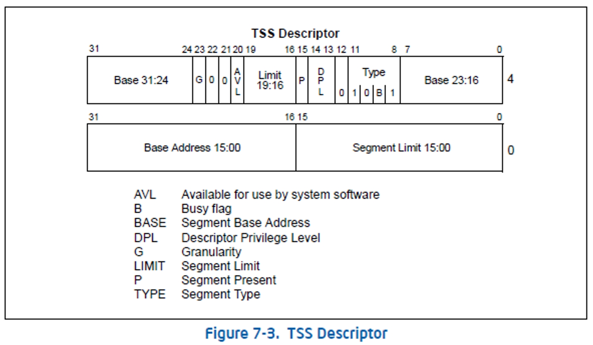

### 要点回顾：

在上一节课中给大家讲解了TSS、TSS 段描述符以及TR段寄存器.

TSS是一块内存，大小104字节.通过TSS可以同时替换“一堆”寄存器，包括通用寄存器和段寄存器等.

CPU通过TR段寄存器来找到TSS.如果我们想用自己的TSS段来替换原来的寄存器，就要修改TR寄存器，TR寄存器的值又是来自TSS段描述

符，那么我们接下来先构造一个段描述符。


### 1、准备TSS所需要的104字节


### 2、TSS的赋值


### 3、TSS段描述符



构造TSS段描述符：XX00e9XX`XXXX0068

```
>eq 8003f0c0 0000e912`fdcc0068
```


### 4、修改TR寄存器

1. 在Ring0 我们可以通过LTR指令去修改TR寄存器

2. 在Ring3 我们可以通过CALL FAR 或者 JMP FAR指令来修改

   

**用JMP去访问一个代码段的时候，改变的是CS和EIP ：**

JMP 0x48:0x123456  如果0x48是代码段 

执行后：CS-->0x48  EIP-->0x123456


**用JMP去访问一个任务段的时候：**

如果0x48是TSS段描述符，先修改TR寄存器，在用TR.Base指向

的TSS中的值修改当前的寄存器


### 5、案例演示


### 课后练习：