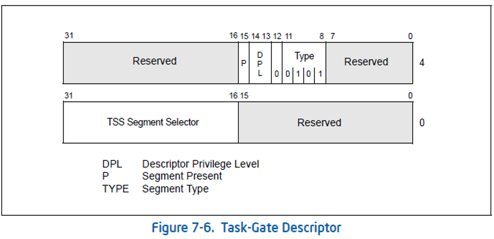

### 要点回顾：

在上一节中讲解了如何通过CALL、JMP指令访问任务段

这一节课主要介绍如何通过任务门去访问任务段

既然已经可以访问任务段了，那为什么还要有任务门呢？


### 1、IDT 中断描述符表

IDT表可以包含3种门描述符：

任务门描述符

中断门描述符

陷阱门描述符


### 2、任务门描述符



构造任务门：0000 e500 00c3 0000

```
> eq 8003f500 0000e500`00c30000
```


### 3、任务门执行过程：

1、INT N

2、查IDT表，找到任务门描述符

3、通过任务门描述符，查GDT表，找到TSS段描述符

4、使用TSS段中的值修改TR寄存器

5、IRETD返回


### 4、案例演示
