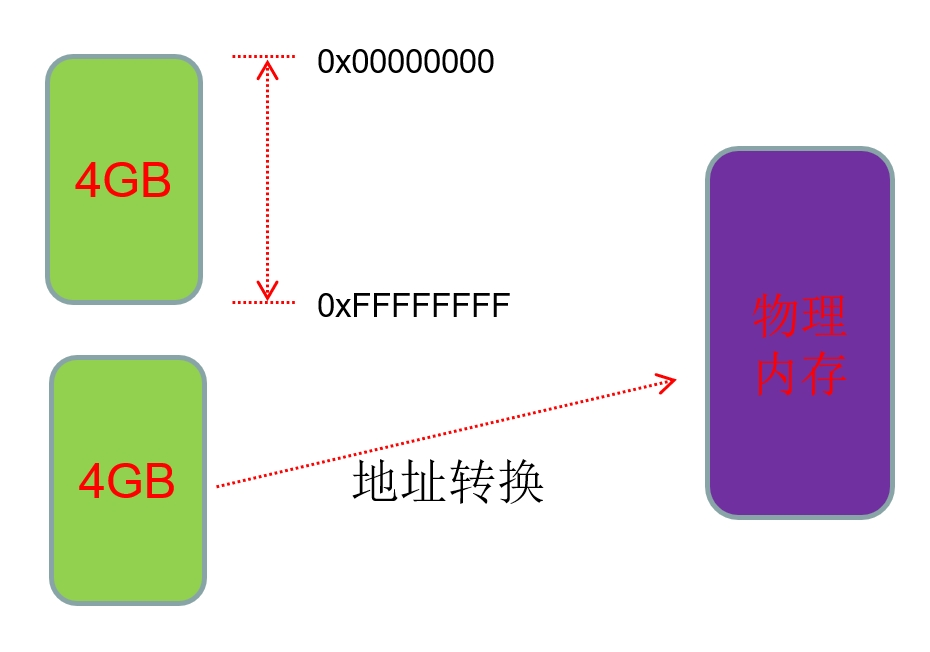
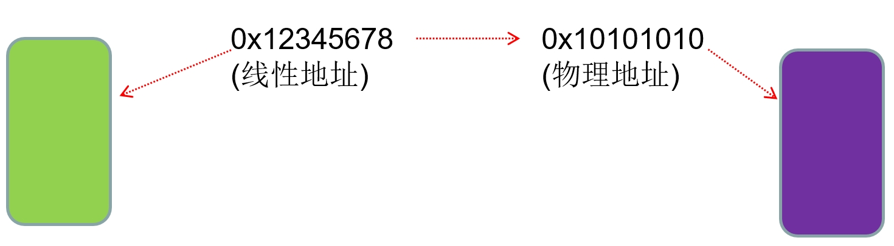
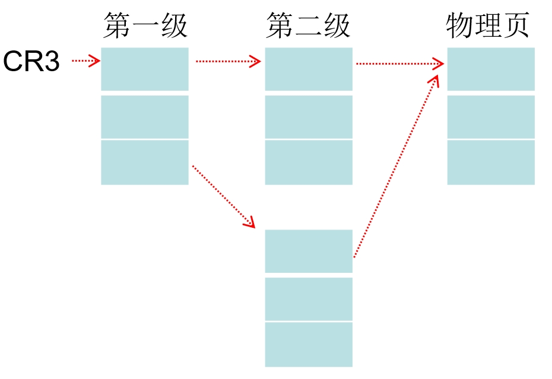
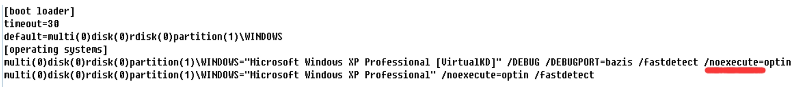

### 要点回顾：

之前的课程主要讲解的是段的机制，其实段的机制还有很多细节，需要大家在实验的过程中详细总结。

从这节课开始，我们学习页的机制.

### 0、4GB内存空间

### 1、物理地址

线性地址、有效地址、物理地址

如下指令：

MOV eax,dword ptr ds:[0x12345678]

其中, 0x12345678 是有效地址

ds.Base + 0x12345678 是线性地址

### 2、物理在哪里？

每个进程都有一个CR3,(准确的说是都一个CR3的值，CR3本身是个寄存器，一个核，只有一套寄存器)
CR3指向一个物理页，一共4096字节,如图：

### 3、设置分页方式

将noexecute 改成 execute

32位系统上将线性地址转为物理地址有2种方式：10-10-12、2-9-9-12。

当该参数为execute时则表示当前的分页机制就是10-10-12，noexecute则表示当前的分页机制为2-9-9-12

### 4、10-10-12分页

实验：找物理地址
