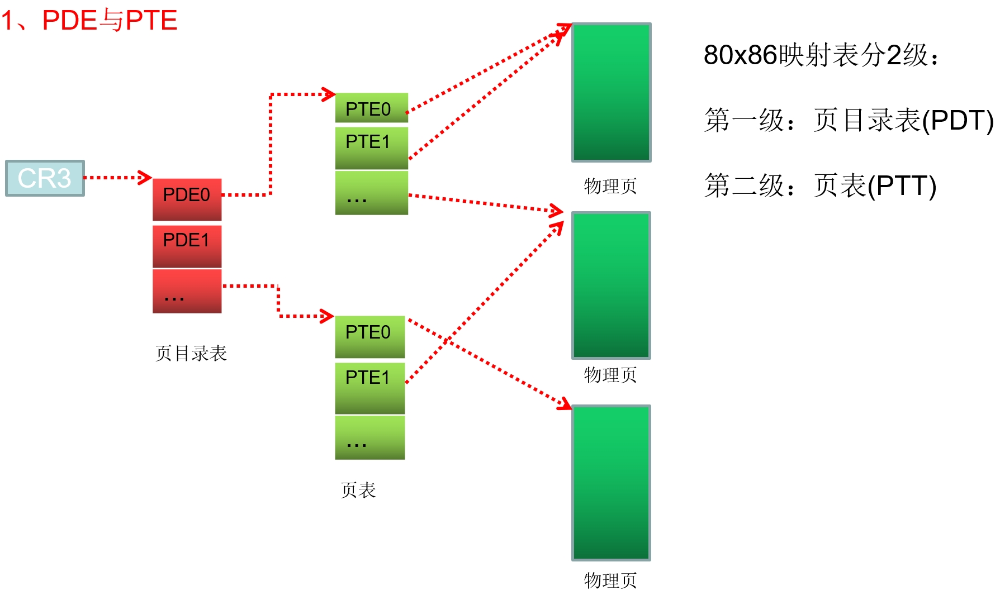

### 要点回顾：

上一节课我们简单了解了80x86的10-10-12分页机制，这一节课我们继续学习.

### 1、PDE与PTE

CR3里存的是唯一的物理地址。

CPU见到一个线性地址时[12345678]，CPU通过CR3来找物理地址。

PDE大小4KB，每一项是4个字节，总共有1024项，就是2的10次方，需要有10位来表示。

PDE的每一项的高20位表示物理地址，指向了另外的物理页，低12位是属性位。

PTE是4个字节，高20位表示物理地址，低12位是属性位。

总共1024个PDE * 1024个PTE * 第个物理页4KB = 4GB

两个线程地址，是否在同一个物理页，只需要判断前20位。

0 - 0xFFF 的地址为什么不能读也不能写。因为 0 线性地址与 FFF 线性地址的 前20位是相同的，在一个物理页。

### 2、指向相同物理页

<1> PTE可以没有物理页，且只能对应一个物理页.

<2> 多个PTE也可以指向同一个物理页.

### 3、实验：

<1> 查分0地址，观察PTE是否有物理页.

<2> 向0地址读写数据.