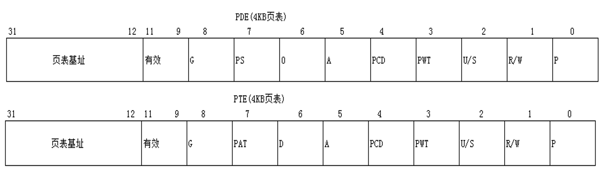

### 要点回顾：

上一节课我们简单了解了PDE/PTE,这一节课我们来了解一下PDE、PTE的属性.

### 1、物理页的属性

物理页的属性 = PDE属性 & PTE属性

### 2、P位

线性地址0 为什么不能访问呢？

没有指定物理页，指定物理页就一定能访问吗？

**先看PDE与PTE的P位  P=1 才是有效的物理页**

### 3、R/W 位

R/W = 0 只读

R/W = 1 可读可写

实验：

定义一个只读类型的变量，再另一个线性地址指向相同的物理页，通过修改PDE/PTE属性，实现可写。

