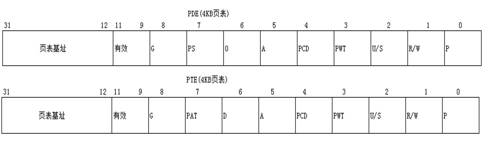

### 1、物理页的属性

物理页的属性 = PDE属性 & PTE属性

### 2、U/S 位

U/S = 0 特权用户

U/S = 1 普通用户

实验：

修改一个高2G线性地址的PDE/PTE属性，实现Ring3可读.

比如：0x8003F00C

0x0 - 0x7FFFFFFF  U/S=1

0x80000000 - 0xFFFFFFFF U/S=0	

### 3、P/S位

只对PDE有意义，PS == PageSize的意思 当PS==1的时候 PDE直接指向物理页 无PTE,低22位是页内偏移。

线性地址只能拆成2段：大小为4MB  俗称“大页”

举例：

分析8043F00C线性地址的PDE属性。

### 4、A 位

是否被访问（读或者写）过 访问过置1 即使只访问一个字节也会导致PDE PTE置1

### 5、D 位

脏位 是否被写过  0没有被写过  1被写过

### 6、关于G位 PWT位 PCD位

学完控制寄存器与TLB才能讲 此处略过。。。