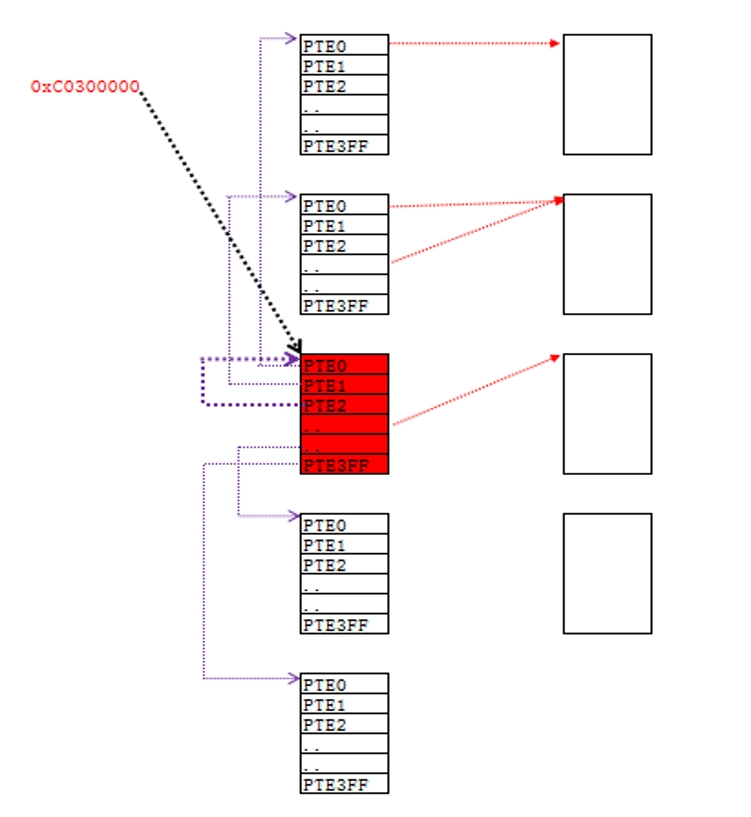

### 内容回顾

在上一节课课后题中我们提到过，如果系统要保证某个线性地址是有效的，

那么必须为其填充正确的PDE与PTE，如果我们想填充PDE与PTE那么必须能够访问

PDT与PTT，那么存在2个问题：

1、一定已经有“人”为我们访问PDT与PTT挂好了PDE与PTE,我们只有找到这个线性地址就可以了。

2、这个为我们挂好PDE与PTE的“人”是谁？

注意：

CR3中存储的是物理地址，不能在程序中直接读取的。如果想读取，也要把Cr3的值挂到PDT和PTT中才能访问，那么怎么通过线性地址访问PDT和PTT呢？

### 1、拆分C0300000

(参加课堂实验)

结论：**C0300000存储的值就是PDT**

如果我们要访问第N个PDE，那么有如下公式：

0xC0300000 + N*4

### 2、页目录表基址(XP系统 10-10-12分页模式)

总结：
1、通过0xC0300000找到的物理页就是页目录表

2、这个物理页即是页目录表本身也是页表

3、页目录表是一张特殊的页表，每一项PTE指向的不是普通的物理页，而是指向其他的页表.

4、如果我们要访问第N个PDE，那么有如下公式：

0xC0300000 + N*4 

1、低2G （0x0 - 0x7FFFFFFF） 几乎不同

2、高2G （0x80000000 - 0xFFFFFFFF） 几乎相同

3、0x0 - 0x7FFFFFFF 的前 64K 和 后64K 都是没有映射的。

要让0线性地址能访问，挂一个PDE/PTE

0xC0300000 这个线性地址

1100 0000 00   =>   300 * 4 = c00

11 0000 0000   =>   300 * 4 = c00

0000 0000 0000  => 0