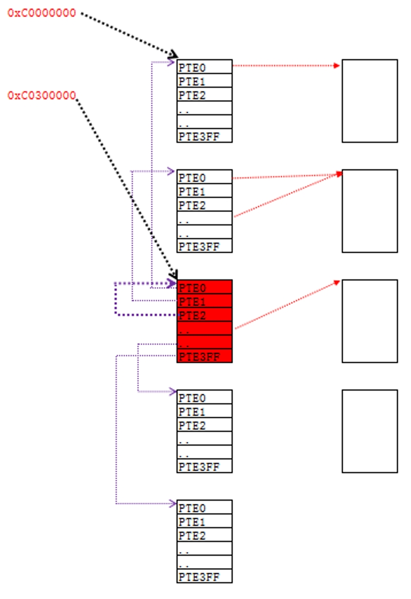

### 内容回顾

上一节课我们讲解了页目录表基址,也就是说通过 0xC0300000 这个线性地址

可以访问一张表，这张表就是**页目录表**，有了这个地址，我们可以任意修改页目录表。

但如果我们要设置某个线性地址PDE和PTE那么还要能够访问PTT，如何访问呢?


### 1、拆分C0000000 / C0001000

(参见课堂实验)


0xC0300000 页目录基址，可以修改任意的PDE

0xC0000000 页表基址，




总结：

1、页表被映射到了从0xC0000000到0xC03FFFFF的4M地址空间

2、在这1024个表中有一张特殊的表：页目录表

3、页目录被映射到了0xC0300000开始处的4K地址空间


### 2、有了0xC0300000和0xC0000000能做什么？

掌握了这两个地址，就掌握了一个进程所有的物理内存读写权限。

公式总结：

1、什么是PDI与PTI

```
10-10-12  
```

2、访问页目录表的公式：

```
0xC0300000 + PDI*4
```

3、访问页表的公式：

```
0xC0000000 + PDI*4096 + PTI*4
```


### 3、思考题：

谁为我们填充0xC0300000和0xC0000000的PDE与PTE呢？