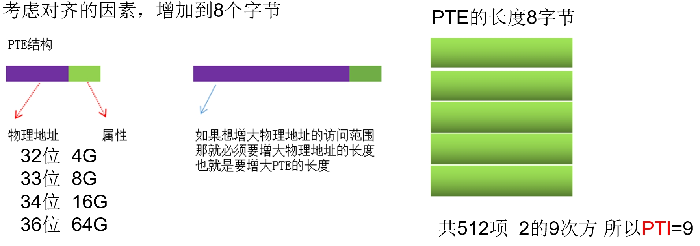
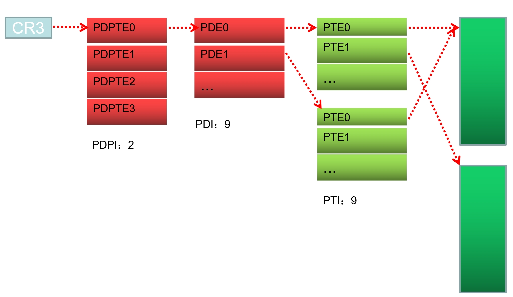

### 内容回顾

在之前的课程中我们讲解了10-10-12分页方式，在这种分页方式下物理地址最多可达4GB。

但随着硬件发展，4GB的物理地址范围已经无法满足要求，Intel在1996年就已经意识到这个问题了，所以设计了新的分页方式.

也就是我们本节课要讲的2-9-9-12分页,又称为PAE（物理地址扩展）分页.

### 1、为什么是10-10-12

1）先确定了页的大小 4K 所以后面的12位的功能就确定了

2）当初的物理内存比较小，所以4个字节的PTE就够了，加上页的尺寸是4K

所以一个页能存储1024个 PTE 也就是2的10次方 第二个10也就确定了.

宽4字节

3）剩下的10为PDI 10+10+12刚好32位 

### 2、为什么是2-9-9-12

1）页的大小是确定的，4KB不能随便改，所以12确定了.

2）如果想增大物理内存的访问范围，就需要增大PTE,增大多少了呢

考虑对齐的因素，增加到8个字节

 

3）同理PDI也是2的9次方 32 - 9 - 9 - 12 还差2位 所以就再做一级 叫PDPI 

### 3、2-9-9-12分页结构(PAE,物理地址扩展)

PDPTE：Page-Directory-Point-Table Entry页目录指针表项 每项占8个字节

### 4、如何开启PAE模式

将C:\boot.ini文件中的execute改为noexecute 重启

(参见课堂实验)