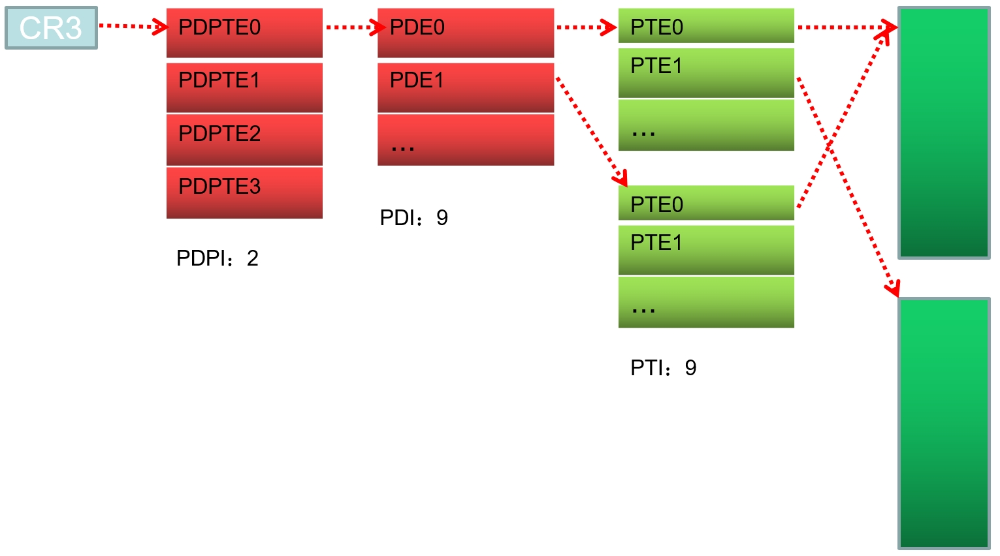
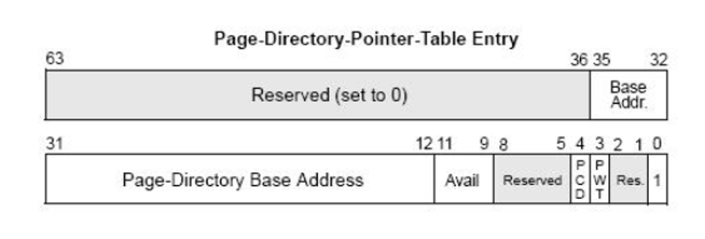
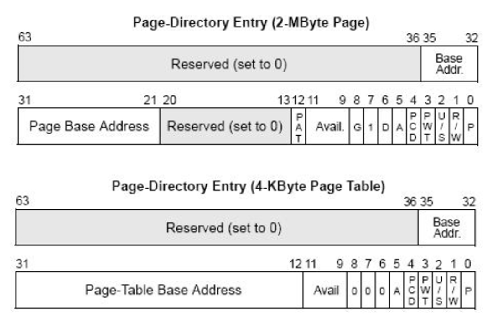
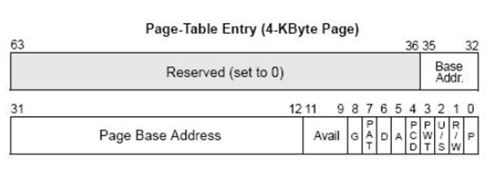

### 内容回顾

PDPTE：Page-Directory-Point-Table Entry页目录指针表项 每项占8个字节

### 1、Page-Directory-Point-Table Entry

1、PDPTE共有四项(第一个2)。

2、35-12 存储的是页目录表的基址，低12位补0，共36位，即页目录基址。

### 2、PDE结构

特别说明：

1、当PS=1时是大页，35-21位是大页的物理地址，这样36位的物理地址的低21位为0，这就意味着页的大小为2MB，且都是2MB对齐。

2、当PS=0时，35-12位是页表基址,低12位补0，共36位。

### 3、PTE结构

特别说明：

PTE中35-12是物理页基址，24位，低12位补0

物理页基址+12位的页内偏移指向具体数据

### 4、XD标志位（AMD中称为NX,即No Excetion ）

PDE/PTE结构

段的属性有可读、可写和可执行

页的属性有可读、可写

当RET执行返回的时候，如果我修改堆栈里面的数据指向一个我提前准备

好的数据（把数据当作代码来执行，漏洞都是依赖这点，比如SQL注入也是）

所以，Intel就做了硬件保护，做了一个不可执行位，XD=1时。那么你的软件溢出

了也没有关系，即使你的EIP蹦到了危险的“数据区”，也是不可以执行的！

在PAE分页模式下，PDE与PTE的最高位为XD/NX位.