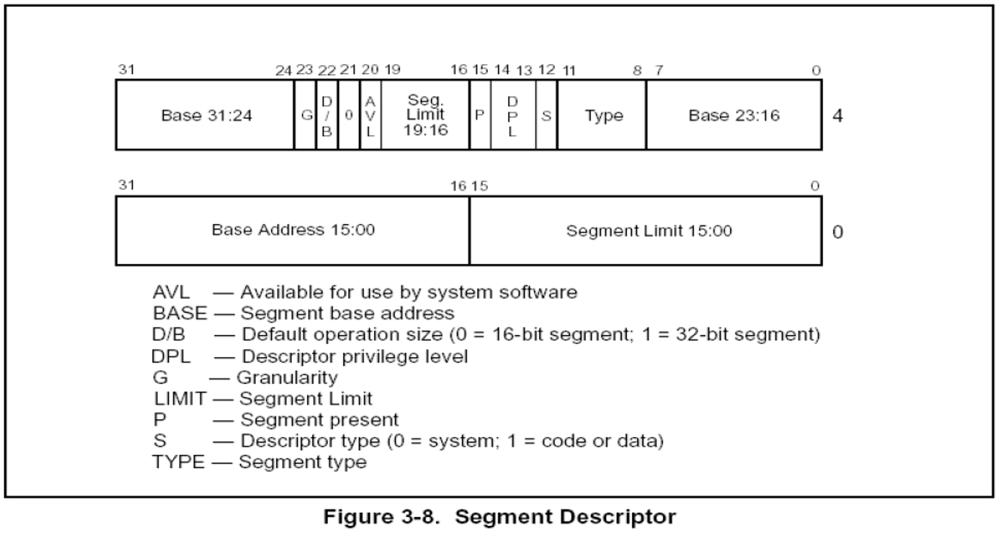

### 要点回顾：

**段寄存器的值是通过段描述符填充的**

但段描述符只有64位，如何从64位变成80位呢?


### 1、段描述符



### 2、P位

P = 1 段描述符有效

P = 0 段描述符无效


### 3、段描述符与段寄存器的对应关系	

WORD  Selector;	    //16位

WORD  Atrribute;	  //16位

DWORD Base;		//32位

DWORD Limit;		//32位      FFFFFFFF	


### 4、G位

G = 1 Limit的高3位补FFF

G = 0 Limit的高3位补000


**段描述符64位怎么变成80位的**，

WORD  Selector;	    //16位   X

WORD  Atrribute;	  //16位   8-23 高四字节

DWORD Base;		//32位   Base 31:24 + Base 23:16 + Base 15:00

DWORD Limit;		//32位   Limit 19:16 + Limit 15:00  = 20位 剩下的12位由G位决定，G为0，则补0，G为1，则补1


### 段选择子拆分实验：

23 2B 30 3B 53

1、先查看GDT表的地址

r gdtr      //读取gdt表的起始位置

r gdtl      //读取gdt表的大小

2、dq GDT 表的地址

```
8003f000  00000000`00000000 00cf9b00`0000ffff
8003f010  00cf9300`0000ffff 00cffa00`0000ffff
8003f020  00cff300`0000ffff 80008b04`200020ab
8003f030  ffc093df`f0000001 0040f300`00000fff
8003f040  0000f200`0400ffff 00000000`00000000
8003f050  80008955`87000068 80008955`87680068
8003f060  00009302`2f40ffff 0000920b`80003fff
8003f070  ff0092ff`700003ff 80009a40`0000ffff
```

3、段选择子占16位，所以 23 = 0023 = 0000 0000 0010 0011

4、RPL=11 TI=0 查GDT，0000 0000 0010 0 x 8 + GDT基址 = 20 + 8003f000 = 8003f020 

5、然后 dq 8003f020 

6、00cff300`0000ffff

7、base = 0000 0000， attr = cff3， limit = ffff ，G = 1


### 课后练习：

​    分析段选择子为0x1B、0x23对应的段描述符，并将内容填写到段寄存器结构体中.

#### 注意：

​    FS对应的段描述符比较特殊，查分后的值与段寄存器中的值不符合，讲到操作系统（线程）的时候会解释.