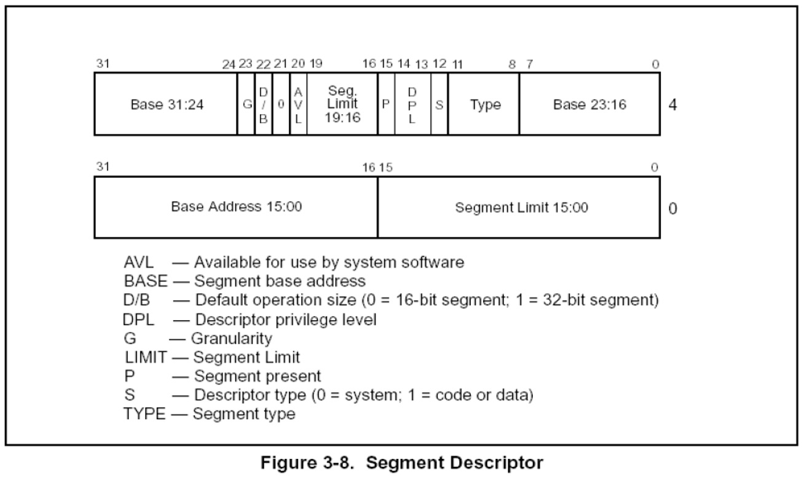
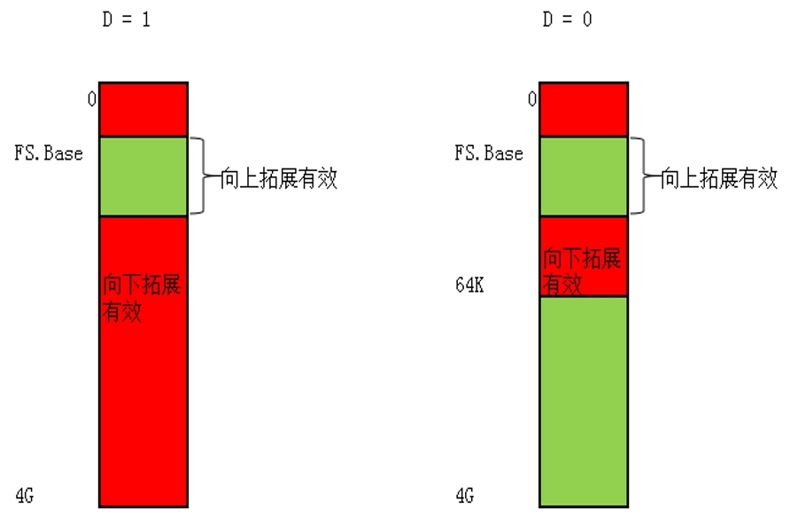

### 描述符属性:DB位

### 情况一：对CS段的影响		
D = 1 采用32位寻址方式

D = 0 采用16位寻址方式	

前缀67 改变寻址方式	

### 情况二：对SS段的影响		

D = 1 隐式堆栈访问指令（如：PUSH POP CALL） 使用32位堆栈指针寄存器ESP

D = 0 隐式堆栈访问指令（如：PUSH POP CALL） 使用16位堆栈指针寄存器SP	

### 情况三：向下拓展的数据段		

D = 1 段上线为4GB	

D = 0 段上线为64KB	

